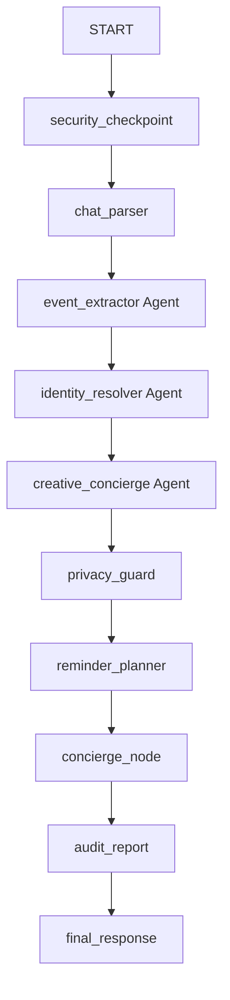

# KinKeeper: Privacy-Safe Family Memory Concierge

## Abstract
**KinKeeper** is a local-first, privacy-safe family memory concierge that automatically extracts and manages important milestones—such as birthdays, anniversaries, and remembrance days—hidden within unstructured, everyday family chat exports. 

Built using the **Google Agent Development Kit (ADK)** and the **Model Context Protocol (MCP)**, KinKeeper chains multiple specialized `LlmAgent` sub-agents into a deterministic pipeline. It features a modern, responsive web dashboard allowing users to upload chat files, view parsed events, receive imminent weekly alerts, edit/delete milestones, and audit system activities. By running entirely locally and incorporating robust PII redaction and prompt injection guards, KinKeeper ensures that raw personal family chats never leave the user's machine.

---

## Category 1: The Pitch — Problem, Solution, Value

### 1.1 Problem Statement & Importance
Messaging platforms (like WhatsApp, iMessage, and Signal) have become the primary medium where families share life updates, celebrate milestones, and express wishes. However, these important dates are easily buried and forgotten in the high volume of daily messages. 
*   **The Utility Gap:** Traditional calendar applications require tedious manual entry of names, event types, and dates, which users rarely maintain.
*   **The Privacy Challenge:** While modern large language models (LLMs) make parsing unstructured chat text easy, uploading raw family chat logs to cloud-based AI systems exposes sensitive private information. Chat history contains phone numbers, emails, home addresses, and private personal stories.
*   **The Reliability Challenge:** General-purpose AI chatbots suffer from context-mixing and hallucinate dates or double-count wishes when multiple family members wish the same person across different time zones.

### 1.2 The Solution: KinKeeper Memory Concierge
KinKeeper automates the entire extraction pipeline without compromising user privacy. It offers:
1.  **Local Web Interface:** A pastel-themed dashboard to upload chat files, paste text, or run a simulated sample.
2.  **Privacy Guard:** A deterministic security layer that redacts all phone numbers, email addresses, and home addresses, and blocks prompt injection attacks.
3.  **Deduplicated Memory Registry:** A multi-agent pipeline that extracts milestones, standardizes nicknames, and merges duplicate wishes.
4.  **Imminent Alert System:** A weekly alert banner displaying relative day countdowns (e.g. *"Today! 🎉"*, *"Tomorrow"*) for events happening in the next 7 days.
5.  **Concierge Actions:** Pre-drafted personalized messages, with quick actions (e.g. call reminder, finding flowers, e-cards) keeping the user in full control with no automatic execution.

### 1.3 Why Agents? Core Concept & Value
A single flat chatbot is inadequate for this task because it struggles to maintain formatting, apply strict privacy rules, and perform complex deduplication simultaneously. KinKeeper resolves this by utilizing an ADK-orchestrated multi-agent workflow:
*   **Role Specialization:** The task is split among three specialized `LlmAgent` sub-agents:
    *   `event_extractor`: Scans parsed chat lines to identify milestones and assign initial confidence.
    *   `identity_resolver`: Normalizes names (e.g. `Liv` and `Olivia` on the same date are merged into `Olivia`) and deduplicates overlapping date entries.
    *   `creative_concierge`: Analyzes the event type to generate tailored greeting drafts and recommend appropriate follow-ups.
*   **State Separation:** The orchestrator manages shared state via `ctx.state`, feeding clean, structured data from one node to the next.
*   **Robust Local Fallback:** When Gemini API free-tier rate limits (429 Resource Exhausted) are hit, a local regex-based parser automatically takes over, ensuring the user gets immediate feedback without data loss or application failure.

### 1.4 YouTube Video Submission Outline
The 5-minute project video is structured as follows:
*   **Minute 0:00 - 1:00 (Problem):** Introduce the value of family milestones and show how easily they are lost in chat histories. Outline the privacy risks of uploading private chats to cloud servers.
*   **Minute 1:00 - 2:00 (Agents & Architecture):** Show the system architecture diagram. Explain why specialized agents (`event_extractor`, `identity_resolver`, `creative_concierge`) are used instead of a generic chatbot.
*   **Minute 2:00 - 3:30 (UI & Live Demo):** Demonstrate the dashboard running locally on `http://127.0.0.1:8000/ui`. Paste a sample chat, show successful extraction, inspect the **Upcoming Weekly Alerts** panel, edit a card, and review the **Privacy Audit** count.
*   **Minute 3:30 - 4:15 (The Build & MCP):** Explain the integration of the local MCP Server, demonstrating how tools read files and write to local databases without network exposure.
*   **Minute 4:15 - 5:00 (Robustness & Security):** Showcase the prompt injection blocker, PII redaction, and the offline fallback extractor working seamlessly when API limits are hit.

---

## Category 2: The Implementation — Architecture, Code & Journey

### 2.1 Technical Design & Agent Architecture
KinKeeper is implemented as a sequential ADK `Workflow` containing ten distinct execution nodes:



1.  **`security_checkpoint` (Node):** Scans inputs for prompt injections and logs block events.
2.  **`chat_parser` (Node):** Segments raw WhatsApp chat lines, parsing standard bracketed and dash-separated timestamp formats.
3.  **`event_extractor` (LLM Agent):** Extracts candidate birthdays, anniversaries, and remembrances.
4.  **`identity_resolver` (LLM Agent):** Deduplicates milestones occurring within a 2-day window and merges name subsets (e.g. `Lisa` and `Lisa & David` anniversary).
5.  **`creative_concierge` (LLM Agent):** Prepares greeting suggestions and actions.
6.  **`privacy_guard` (Node):** Applies regex PII masking to names, snippets, and drafts.
7.  **`reminder_planner` (Node):** Invokes the local MCP tool `generate_reminder_schedule` to compute calendar dates.
8.  **`concierge_node` (Node):** Groups extracted data into `captured_events` (high/medium confidence) and `needs_review` (low confidence).
9.  **`audit_report` (Node):** Aggregates PII and system stats, appending them to the audit log.
10. **`final_response` (Node):** Formats output structures for UI rendering.

### 2.2 Local MCP Server & KinKeeper Custom Tools
To keep data local and securely sandboxed, KinKeeper runs a local Model Context Protocol (MCP) server exposing six domain-specific tools:
1.  `read_sample_chat_export`: Safely reads WhatsApp export logs from the sandboxed folder.
2.  `save_captured_events`: Writes verified milestones to `data/events.json`.
3.  `list_captured_events`: Reads stored milestones.
4.  `generate_reminder_schedule`: Calculates 30-day, 7-day, and same-day countdown schedules.
5.  `suggest_demo_actions`: Recommends follow-up actions for UI presentation.
6.  `write_audit_log`: Appends structured JSON records to `artifacts/audit_log.jsonl` for observability.

### 2.3 Robustness & UI Features
*   **Offline Fallback Parser (`extract_events_offline`):** Integrates directly with the `/api/analyze` FastAPI endpoint. If the Gemini API returns a `429 RESOURCE_EXHAUSTED` error, the system catches the exception and launches a local regex-based parsing engine. This keeps the application fully functional offline.
*   **Upcoming Alerts Panel:** The dashboard scans all events and calculates the time difference between the system date and the milestone date. Events happening within **7 days** are sorted and pinned to the top of the UI with real-time countdown tags (*"Today! 🎉"*, *"Tomorrow"*, *"In 3 days"*).

### 2.4 Security & Privacy Architecture
We applied the **STRIDE Threat Modeling Framework** to ensure complete security:
*   **Spoofing / Tampering:** File paths in MCP tools are validated against a strict sandbox path, preventing directory traversal.
*   **Information Disclosure:** Personally Identifiable Information (PII) is masked using regular expressions. Raw chat files are never stored in the database; only sanitized, extracted event metadata is saved.
*   **Denial of Service:** The offline fallback engine intercepts rate-limiting errors to prevent UI crashes.
*   **No Auto-Send Boundary:** All concierge suggestion buttons are local placeholders, ensuring that no message, call, or flower order can be sent without explicit user action.
*   **Environment Safety:** The `.env` file is excluded from commits via `.gitignore`. A `.env.example` file is provided for setup.

### 2.5 Testing & Evaluations
KinKeeper enforces a strict test-driven development (TDD) cycle:
*   **Gherkin Specs (`specs/kinkeeper.feature`):** Contains 11 Given-When-Then scenarios checking PII redaction, prompt injection, duplicate wish merging, and UI API endpoints.
*   **Automated Tests (`make test`):** Executes 30 unit and BDD tests using `pytest` and `pytest-bdd` (completing in under 6 seconds).
*   **Offline Evals (`make eval`):** Runs 10 evaluation test cases (`evals/test_cases.json`) to programmatically verify extraction accuracy, checking that no raw chats or PII leak into saved databases.

### 2.6 Setup & Reproducibility
The local-first architecture is simple to set up and run:
```bash
# 1. Clone project and navigate to folder
cd KinKeeper/kinkeeper

# 2. Create virtual environment and install dependencies
uv venv
source .venv/bin/activate
uv pip install -e .

# 3. Configure local environment variables
cp .env.example .env

# 4. Run tests and evaluations
make test
make eval

# 5. Launch local application
make run
```
Access the application at `http://127.0.0.1:8000/ui`.

---

## Conclusion
KinKeeper demonstrates that family relationship management can be automated using advanced multi-agent workflows without sacrificing personal privacy. Chaining specialized ADK agents, sandboxing filesystem actions with local MCP tools, and handling API rate limits with offline regex fallbacks makes KinKeeper a robust, secure, and deployable solution.
