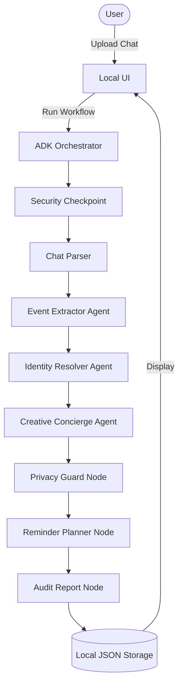

# KinKeeper System Architecture

KinKeeper is built on top of the Google Agent Development Kit (ADK) and structured as a deterministic pipeline/workflow chaining multiple specialized agents.

## Component Overview

1.  **Local UI:** A FastAPI/HTML dashboard allowing users to upload or paste chat exports, view captured memories, edit/delete milestones, and audit system logs.
2.  **ADK Orchestrator Workflow:** Chaperones the execution sequence, sharing workflow state securely via `ctx.state`.
3.  **Specialized Agents:**
    *   `event_extractor` (LLM): Detects birthday, anniversary, and remembrance candidates from raw chats.
    *   `identity_resolver` (LLM): Resolves nicknames and merges duplicates within a 2-day event window.
    *   `creative_concierge` (LLM): Generates emotional wishes and suggestions.
4.  **Local MCP Server:** Exposes tools for filesystem access, keeping raw chat files local.
5.  **Local Storage Artifacts:** `events.json` (captured milestones) and `audit_log.jsonl` (observability log).

## Data Flow Diagram

